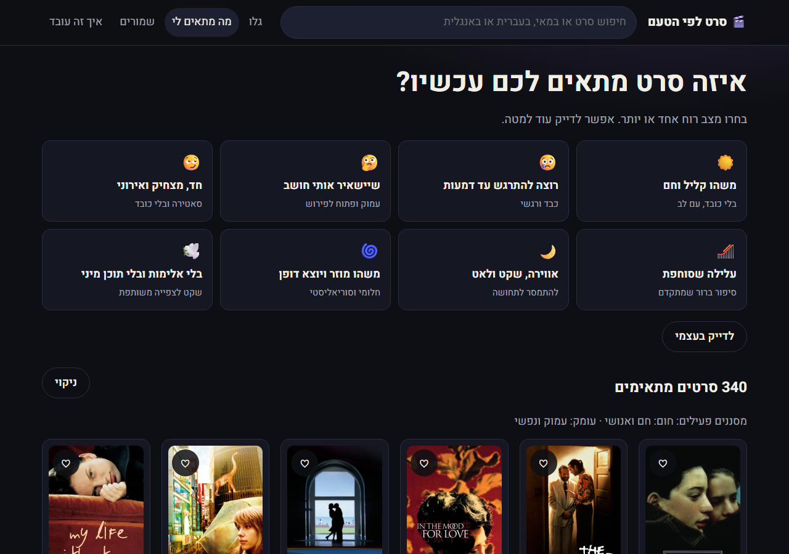
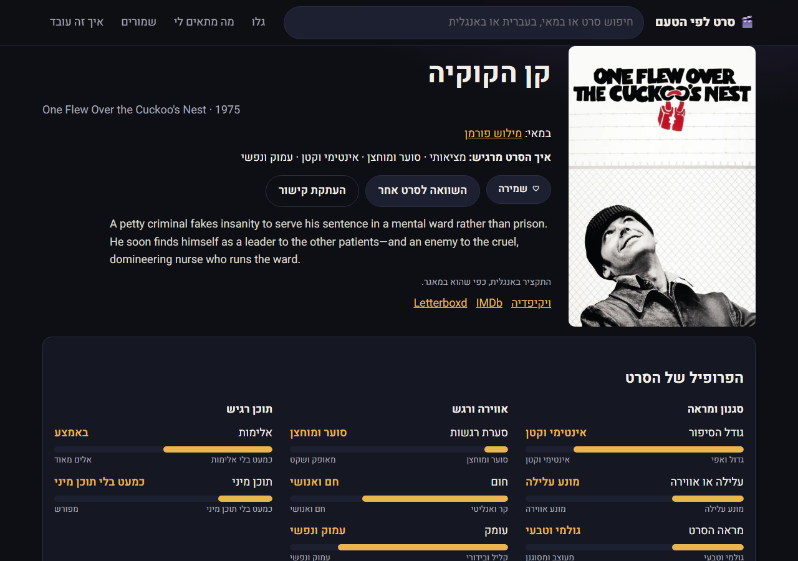
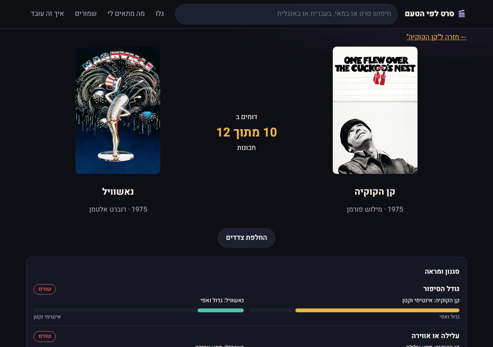
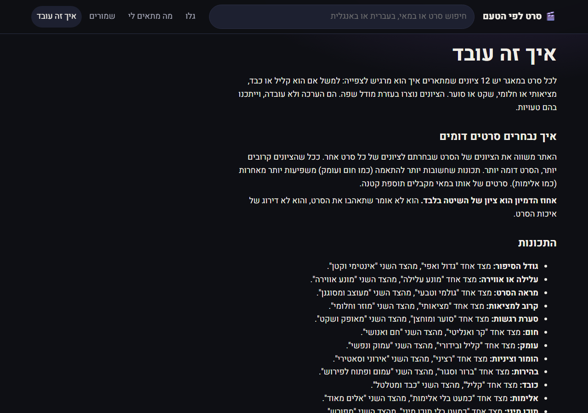

# 🎬 CineMate

Find movies by how they *feel*, not by genre. CineMate is a Hebrew, right-to-left web app over a catalog of about 1,050 films. Each film is scored on 12 "mood DNA" dimensions, and the app uses those scores to recommend similar movies, filter by mood, and compare two films side by side.


## Screenshots

| Find by mood | Movie page |
|---|---|
|  |  |

| Compare two movies | How it works |
|---|---|
|  |  |

## Tech stack

- **React 18** + **TypeScript**, bundled with **Vite 5**
- **React Router 6** for client-side routing
- **Heebo** variable font (via `@fontsource-variable/heebo`)
- Plain CSS (`src/styles.css`) with a dark theme and full RTL layout
- No backend: the app is a fully static single-page app

## Getting started

Requires Node 18+.

```bash
npm install
npm run dev        # dev server at http://localhost:5173
npm run build      # type-check + production build to dist/
npm run preview    # serve the production build locally
```

### Environment variables (optional)

See `.env.example`:

| Variable | Purpose |
|---|---|
| `VITE_DATA_URL` | URL of the movie database JSON |
| `VITE_IMAGE_BASE` | Base URL for poster and director images |
| `BASE_PATH` | Public base path at build time (default `/`) |

## How it works

### Data loading (`src/data.tsx`)
On startup, `DataProvider` loads the movie database bundled in `public/data-snapshot.json`. If `VITE_DATA_URL` is set, it fetches that URL first and falls back to the bundled copy. Each film has a Hebrew synopsis (`synopsis_he`), shown on the movie page; the English synopsis is the fallback, and corrected English synopses (`synopsis_en_corrected`) replace the originals. Translations flagged as not matching the film (`synopsis_mismatch`) are hidden. For films whose director was corrected (`director_fixed`), the Hebrew name, photo and Wikipedia link are taken from another film by the same director. Raw records are cleaned and normalized: titles, director keys, image URLs and a search string are prepared, and bad or duplicate links are hidden. Directors are grouped from the movie list. Saved movies are stored in `localStorage`.

### The 12 dimensions (`src/metrics.ts`)
Each movie has 12 scores grouped into three families:

| Group | Dimensions |
|---|---|
| Style & look | story scale, plot vs. mood, raw vs. stylized, grounded vs. surreal |
| Mood & emotion | restraint, warmth, psychological depth, irony/satire, ambiguity, heaviness |
| Sensitive content | violence, sexuality |

Most dimensions are on a 1–10 scale; violence and sexuality are on a 1–5 scale. Each dimension has a weight, so warmth and depth count more than violence when matching. The "mood" presets on the *Find* page map to combinations of low/medium/high buckets.

### Similarity (`src/similarity.ts`)
1. Every score is converted to a **z-score** using the mean and standard deviation across the whole catalog.
2. The distance between two movies is a **weighted Euclidean distance** over the 12 z-scores.
3. Distances are scaled by the 40th percentile and turned into a 0–100 match score:
   `score = 100 · exp(−0.45 · (d / p40)^1.3)`
4. Films by the same director get a small bonus (+6, capped at 96).
5. **"Why it's similar"** explanations pick up to three dimensions where both films are close *and* far from the middle of the scale, so they share something distinctive rather than both being average.

Users can tune the weights per dimension. The weights are stored in the URL, so results can be shared.

## Project structure

```
src/
  main.tsx            app entry, router and data provider
  App.tsx             routes and layout
  data.tsx            data fetching, cleaning, saved-movies store
  metrics.ts          the 12 dimensions, labels, weights, moods
  similarity.ts       z-scores, distance, match score, explanations
  hooks.ts            memoized catalog statistics
  components/         Header, movie cards, movie picker
  pages/              Home, Find, Movie, Compare, Director, Saved, Search, About
public/
  data-snapshot.json  the movie database (bundled with the app)
```

## Routes

| Path | Page |
|---|---|
| `/` | Home: browse all movies, quick search |
| `/find` | Pick a mood or fine-tune dimensions |
| `/movie/:id` | Movie profile and similar movies |
| `/compare/:a/:b` | Side-by-side comparison |
| `/director/:key` | Director filmography |
| `/saved` | Saved movies |
| `/search` | Search results |
| `/about` | Explanation of the method |
